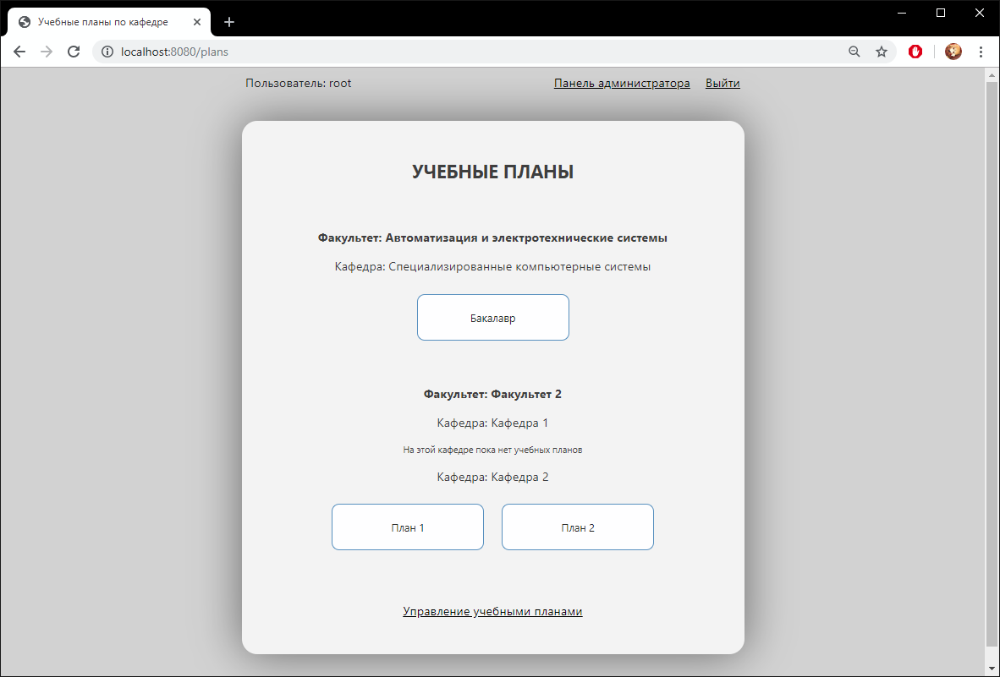

# AcademicPlan

Web-приложение "Учебный план"

Цель работы – создание системы формирования учебного плана в виде сетевого приложения для обеспечения необходимой информацией всех участников учебного процесса – кафедры, деканаты, иные подразделения, участвующие либо обеспечивающие учебный процесс в ВУЗе. 

Объект исследования – процесс построения архитектуры приложения и базы данных учебного плана, их взаимодействие и соответствие требованиям, предъявляемым к учебному плану как к документу. 

Предмет исследования – модели архитектуры приложения, базы данных, модели взаимодействия клиентов с данными. 

Язык программирования: Java; 
СУБД: MariaDB; 
Технология взаимодействия с клиентами: Servlet; 
Технология проектирования: Java Servlet Pages; 
Драйвер для подключения к базе данных: JDBC; 
Web-сервер: Apache Tomcat Server; 
Сборщик проекта: Maven. 

### Пример работы:  
####  Окно авторизации   

####  Страница учебных планов  
На странице учебных планов находится список всех доступных учебных планов, по факультету и кафедре.   

####  Управление учебными планами  
На странице управления есть возможности для добавления, удаления, редактирования и восстановления удалённых данных.   
  

####  Панель администратора  
На панели администратора находятся аналогичные страницы для редактирования пользователей, кафедр, факультетов и пр.  

####  Титульная страница учебного плана  
Страница редактирования данных на титульной странице учебного плана. На нижней панели находятся кнопки контроля версий, редактирования циклов, практик, аттестация и экспорт в pdf. Есть возможность создавать разные версии одного учебного плана.   

####  Страница циклов учебного плана  
Страница циклов содержит дисциплины по курсам, семестрам и неделям.   

####  Страница итога  
На странице итога находятся итоговые результаты по подсчету всех параметров учебного плана. Окно анализа ученого плана необходимо для того что бы проверить правильность заполнения учебного плана и соответствие его требованиям.   
  

